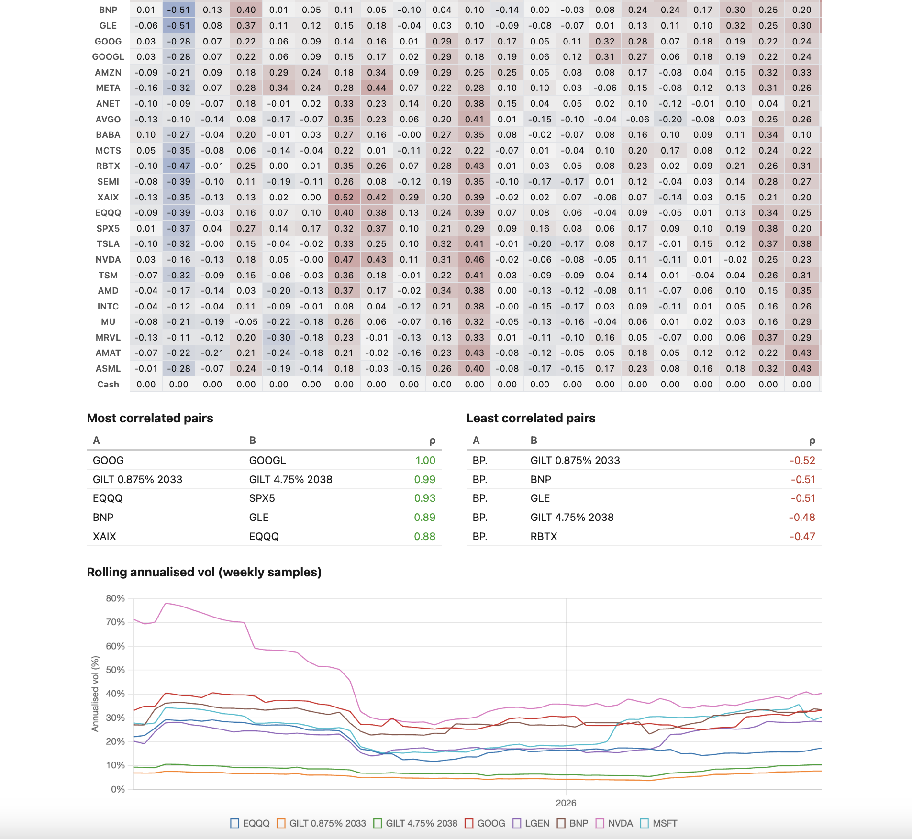
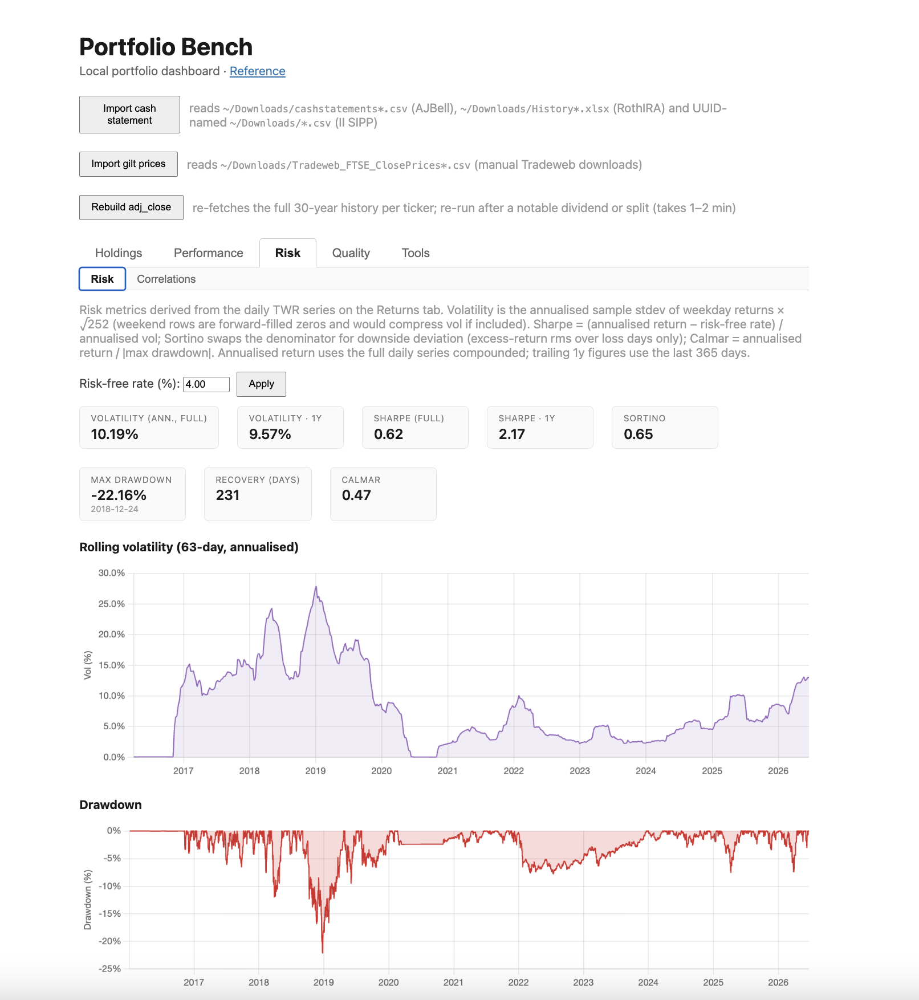

# Portfolio Bench

A local-first portfolio aggregator and analytics dashboard for a multi-broker retirement
portfolio (AJ Bell SIPP, City Roth IRA, Interactive Investor SIPP). Parses
the broker exports, reconciles them against intraday Yahoo Finance prices and
Frankfurter FX rates, persists everything to SQLite, and renders ~18 analytics tabs
through a server-side Thymeleaf + htmx + Chart.js UI.


## Screenshots




## TL;DR

Java 25 / Spring Boot 3 web app. ~18.5 kLOC, **250+ unit tests**, clean
ports-and-adapters layering with Spring confined to `web` + `config`. SQLite via JDBC
(no ORM), Apache POI for Excel I/O, server-rendered UI with no frontend build
pipeline. Single Maven module. Built solo with Claude as an AI pair programmer.

## What it does

- **Multi-broker reconciliation.** Each broker has its own export format, dedup
  rules, and quirks — AJ Bell can retroactively insert a dividend mid-file and shift
  every later balance; II's holdings CSV omits cash; Citi needs a brought-forward
  USD seed. Each is parsed by a dedicated `CashTransactionParser` with broker-specific
  composite dedup keys, so re-importing yesterday's statement is always safe.
- **FIFO lot accounting + dividend attribution.** Share lots are rebuilt from the cash
  ledger; DIVIDEND rows are apportioned back to the lots that earned them, in native
  currency at the ex-date, then totalled in GBP.
- **TWR + money-weighted (IRR) returns**, annual return bars, max-drawdown / Sharpe /
  Sortino / Calmar with an underwater chart, drawdown-aware tick formatting.
- **Correlation matrix + diversification ratio over time** — daily log returns on
  native total-return prices, cluster-reordered heatmap so high-ρ blocks sit on the
  diagonal, rolling vol chart, DR-over-time line that visualises correlation contagion
  during selloffs.
- **Live tab** via Server-Sent Events — 1-minute Yahoo intraday refresh, per-cell
  flash animation on price change, quote-age colour coding so `.L` (LSE) names
  visibly freeze post-close.
- **Trade journal** keyed by SQLite `rowid` — annotations (FOMO / fear / conviction /
  rebalance / …) survive re-imports because each broker's dedup path preserves rowids.
- **Snapshot diffing, what-if planner, target-allocation drift, currency exposure,
  attribution windows, Excel export.** ~18 tabs in total.

## Architecture

Ports and adapters. `domain` is pure Java. `port` defines small SPIs
(`FxRateProvider`, `HistoricalFxRateProvider`). `adapter` implements them against
Frankfurter, Yahoo, dividenddata.co.uk. `application` orchestrates use cases.
`persistence` owns all JDBC. `web` and `config` are the only Spring-aware layers.

```
web ──► application ──► domain
        │            ▲
        ├► port ◄── adapter (Yahoo, Frankfurter, …)
        └► persistence (SQLite)
```

Cross-cutting design notes — FX convention, persistence invariants, broker dedup
rules, the price-history feed pipeline — live in [`CLAUDE.md`](CLAUDE.md), the file
that grounds the AI pair programmer between sessions. It's effectively the
architecture document.

## Stack

| Layer        | Choice                                          |
|--------------|-------------------------------------------------|
| Language     | Java 25 (LTS)                                   |
| Framework    | Spring Boot 3 (web layer only)                  |
| Persistence  | SQLite via JDBC, no ORM                         |
| Excel I/O    | Apache POI                                      |
| Templating   | Thymeleaf                                       |
| Frontend     | htmx + Chart.js 4 (CDN, no build chain)         |
| Build        | Maven                                           |
| External APIs| Yahoo Finance, Frankfurter (FX), dividenddata   |

## Quality signals

- **250+ unit tests** covering parsers, dedup, FIFO, dividend attribution, FX, returns,
  correlations, concentration. The single live-API test is tagged `@Tag("integration")`
  and excluded from default runs; Yahoo parsing is covered by a captured JSON fixture.
- All fixtures under `src/test/resources/` are **synthetic** — no real brokerage
  exports have ever been committed.
- Write paths throw `IllegalStateException` on failure and surface as a friendly
  error fragment via `@ExceptionHandler`. Read paths and background-job inserts log
  and degrade so the scheduler can never crash the app.
- Per-broker dedup is idempotent and tested — re-importing the same cash statement
  is a no-op.

## Run locally

```bash
mvn spring-boot:run                  # foreground
scripts/start.sh / scripts/stop.sh   # daemon, log under ~/log/portfolio-bench.log
mvn test                             # unit tests (integration excluded by default)
```

Then open <http://127.0.0.1:8080>. The server binds to loopback only — there's no
auth, it's a single-user local tool. Directories are overridable via
`--portfolio.input-dir=…`, `--portfolio.db-dir=…`, `--portfolio.output-dir=…`.

## Development notes

Built solo with Claude as an AI pair programmer (architecture, review, and per-feature
slicing remained mine; the AI handled mechanical implementation, test scaffolding,
and refactors under direction). The commit history reflects the cadence: each tab
or analytic ships as its own focused commit with tests, and [`CLAUDE.md`](CLAUDE.md)
codifies the architectural invariants the AI must respect across sessions.
